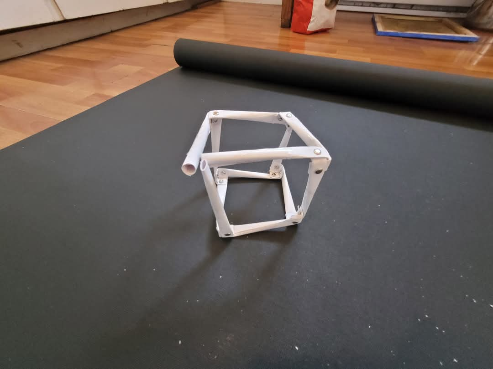

# Supercube

A Bridge to Terrabythia   
My gift to Whoever can  
Read this Map ··· 𐤀⦡A⦠   

# Supercube Proof of the Pythagorean Theorem

 
 
 

# CRAFT TIME 

Supercube from Paper Straws

 
 
 
 
 
 
 
 
 
 

# THE CAY

This is neat.

How to fold a box.

Extremely rough prototype of a   
 
  
Crinkle Cut Supercube -- also known as

Aphantasia Makes It Harder to Visualize

Your Past And Future

